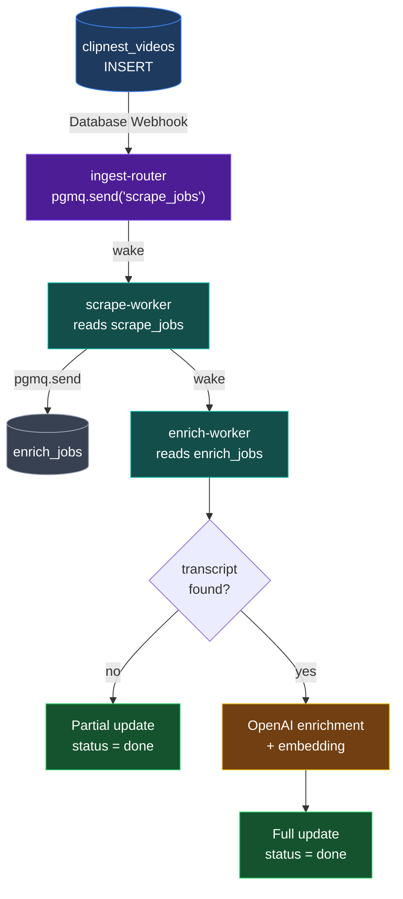

# PGMQ Queue Architecture

PGMQ (Postgres Message Queue) replaces direct HTTP calls between Edge Functions with a durable queue built inside Postgres. If a function crashes mid-job, the message automatically reappears for retry — no jobs are silently lost.

## Flow



## Status Flow

Every `clipnest_videos` row moves through these statuses, visible in the Supabase Table Editor:

```
pending → scraping → enriching → done
                ↘               ↗
                    failed
```

| Status | Set by | Meaning |
|---|---|---|
| `pending` | `ingest-router` | Job queued, not yet picked up |
| `scraping` | `scrape-worker` | Fetching transcript + metadata |
| `enriching` | `enrich-worker` | Running OpenAI enrichment + embedding |
| `done` | `enrich-worker` | Pipeline complete |
| `failed` | any worker | Unrecoverable error (see `processing_error`) |

## Visibility Timeout (VT)

When a worker reads a message, it becomes **invisible** to other workers for the VT duration:

```
Worker reads message → locked for VT seconds
        ↓
  success → pgmq.archive() → message gone permanently
  crash   → VT expires     → message reappears → retry
```

| Queue | VT | Reason |
|---|---|---|
| `scrape_jobs` | 120s | ScrapeCreators API calls |
| `enrich_jobs` | 300s | Two OpenAI calls (chat + embedding) |

## Poison Pill Protection

If a message has been read more than **3 times** (`read_ct > 3`), it is assumed to be permanently broken:

1. Worker marks the row `processing_status = 'failed'` with a message in `processing_error`
2. Worker calls `pgmq.archive()` to remove the message permanently

This prevents a bad message from retrying forever.

## Queues

| Queue | Producer | Consumer | Table (live) | Table (archived) |
|---|---|---|---|---|
| `scrape_jobs` | `ingest-router` | `scrape-worker` | `pgmq.q_scrape_jobs` | `pgmq.a_scrape_jobs` |
| `enrich_jobs` | `scrape-worker` | `enrich-worker` | `pgmq.q_enrich_jobs` | `pgmq.a_enrich_jobs` |

## Viewing Queues in Supabase

**Table Editor** → schema dropdown → select `pgmq` → choose a table:
- `q_scrape_jobs` — messages currently waiting or in-flight
- `a_scrape_jobs` — successfully processed messages (audit log)

**SQL Editor:**
```sql
-- Live messages
SELECT * FROM pgmq.q_scrape_jobs;
SELECT * FROM pgmq.q_enrich_jobs;

-- Archived (successfully processed)
SELECT * FROM pgmq.a_scrape_jobs;
SELECT * FROM pgmq.a_enrich_jobs;

-- Monitor row status
SELECT id, video_url, processing_status, processing_error
FROM clipnest_videos
ORDER BY created_at DESC;
```

## Setup

Run `sql/pgmq_migration.sql` in the Supabase SQL Editor once before deploying:

```bash
# Then deploy all functions
npm run deploy
```

The migration:
1. Enables the `pgmq` extension
2. Creates `scrape_jobs` and `enrich_jobs` queues
3. Adds `processing_status` and `processing_error` columns to `clipnest_videos`
4. Creates public RPC wrappers so Edge Functions can call pgmq via `supabase.rpc()`
