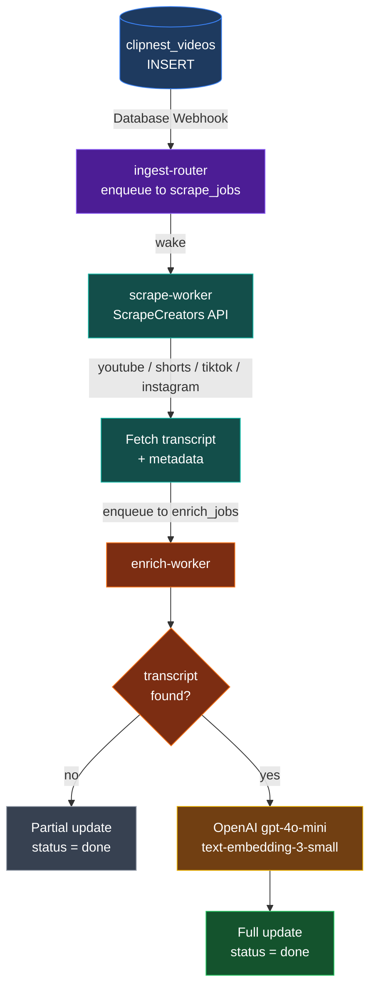

# ClipNest-Ingestion

Supabase Edge Function pipeline that automatically enriches new `clipnest_videos` rows with transcript, metadata, AI analysis, and vector embeddings — triggered by a Database Webhook on every INSERT.

## Flow



## Functions

| Function | Responsibility |
|---|---|
| `ingest-router` | Validates INSERT webhook, enqueues to `scrape_jobs`, wakes `scrape-worker` |
| `scrape-worker` | Reads `scrape_jobs`, fetches transcript + metadata for all platforms, enqueues to `enrich_jobs` |
| `enrich-worker` | Reads `enrich_jobs`, runs OpenAI enrichment + 1536-dim embedding + DB update |

See [QUEUE.md](./QUEUE.md) for full queue architecture and status tracking details.

## Supported Platforms

| Platform | URL pattern |
|---|---|
| YouTube | `youtube.com/watch`, `youtu.be` |
| YouTube Shorts | `youtube.com/shorts/` |
| TikTok | `tiktok.com` |
| Instagram | `instagram.com` |

## Deploy

### One-time setup
```bash
supabase login
supabase link --project-ref <project-ref>
supabase secrets set \
  SCRAPECREATORS_API_KEY=<key> \
  OPENAI_API_KEY=<key> \
  SUPABASE_SERVICE_ROLE_KEY=<key> \
  CLIPNEST_FUNCTION_KEY=<anon-jwt>   # eyJ... from Dashboard → Project Settings → API
```

Also run `sql/pgmq_migration.sql` in the Supabase SQL Editor.

### Deploy all functions
```bash
npm run deploy
```

### Configure the Database Webhook
In the Supabase Dashboard → **Database → Webhooks → Create a new hook**:

| Field | Value |
|---|---|
| Table | `clipnest_videos` |
| Events | INSERT |
| URL | `https://<project-ref>.supabase.co/functions/v1/ingest-router` |
| Header: `Authorization` | `Bearer <anon-key>` |

## Logs
```bash
npm run logs:router   # tail ingest-router
npm run logs:enrich   # tail enrich-worker
supabase functions logs <name> --tail
```

## Project Structure

```
supabase/
  functions/
    ingest-router/      — webhook entry point
    scrape-worker/      — all-platform scraper (YouTube, TikTok, Instagram)
    enrich-worker/      — OpenAI enrichment + DB update
    _shared/
      types.ts          — shared interfaces + ProcessingStatus enum
      utils.ts          — shared helpers + queue helpers
      deno.d.ts         — Deno ambient types for VS Code
scripts/
  deploy.sh             — deploys all functions
sql/
  clipnest_videos.sql   — DB schema reference
  pgmq_migration.sql    — PGMQ queues + status columns migration
```
