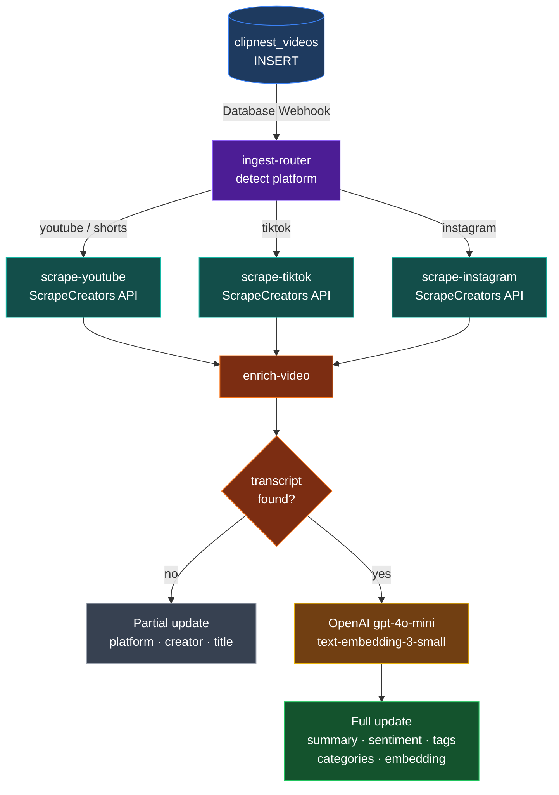

# ClipNest-Ingestion

Supabase Edge Function pipeline that automatically enriches new `clipnest_videos` rows with transcript, metadata, AI analysis, and vector embeddings — triggered by a Database Webhook on every INSERT.

## Flow



## Functions

| Function | Responsibility |
|---|---|
| `ingest-router` | Validates INSERT webhook, detects platform, fans out to scraper |
| `scrape-youtube` | Fetches transcript + metadata in parallel via ScrapeCreators |
| `scrape-tiktok` | Fetches transcript + metadata via ScrapeCreators |
| `scrape-instagram` | Fetches transcript + metadata via ScrapeCreators |
| `enrich-video` | OpenAI enrichment + 1536-dim embedding + Supabase DB update |

## Supported Platforms

| Platform | URL pattern |
|---|---|
| YouTube | `youtube.com/watch`, `youtu.be` |
| YouTube Shorts | `youtube.com/shorts/` |
| TikTok | `tiktok.com` |
| Instagram | `instagram.com` |

## Deploy

### One-time setup
```bash
supabase login
supabase link --project-ref <project-ref>
supabase secrets set \
  SCRAPECREATORS_API_KEY=<key> \
  OPENAI_API_KEY=<key> \
  SUPABASE_SERVICE_ROLE_KEY=<key>
```

### Deploy all functions
```bash
npm run deploy
```

### Configure the Database Webhook
In the Supabase Dashboard → **Database → Webhooks → Create a new hook**:

| Field | Value |
|---|---|
| Table | `clipnest_videos` |
| Events | INSERT |
| URL | `https://<project-ref>.supabase.co/functions/v1/ingest-router` |
| Header: `Authorization` | `Bearer <anon-key>` |

## Logs
```bash
npm run logs:router   # tail ingest-router
npm run logs:enrich   # tail enrich-video
supabase functions logs <name> --tail
```

## Project Structure

```
supabase/
  functions/
    ingest-router/      — webhook entry point
    scrape-youtube/     — YouTube + Shorts scraper
    scrape-tiktok/      — TikTok scraper
    scrape-instagram/   — Instagram scraper
    enrich-video/       — OpenAI enrichment + DB update
    _shared/
      types.ts          — shared interfaces
      utils.ts          — shared helpers
      deno.d.ts         — Deno ambient types for VS Code
  process-video/        — legacy monolithic function (kept for reference)
scripts/
  deploy.sh             — deploys all functions
sql/
  clipnest_videos.sql   — DB schema reference
```
